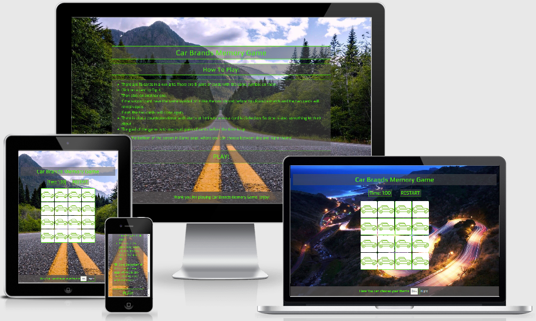

# Car Brands Memory Game

Play the game - [live link here!](https://dimitar-4.github.io/ms2-memory-game/) 

 A simple concentration card game where the player have to match pairs of cards with the same symbols on them for a limited time.
As the name suggests the symbols/logos on the cards are from different car manufacturers.

## User Experience (UX)

### User Stories:
* As a user, I want to be entertained by a simple and relaxing game.
* As a user, I expect easy to read game menu, options and features so that everything is understandable with just one look.
* As a user, I want to play a game that helps me concentrate.
* As a user, I want to play a game that can bring a possitive effect on my memory skills.
* As a user, I want to play a game that covers object that I'm iterested in.

### Strategy:

 The goal for both the user and the owner in this case are exactly the same. The goal is to give the player a pleasent experience while playing. 

### Scope: 

 The player will be provided with features such as complete "how to play" instructions, an option to choose from light and dark theme for the game backgraund, 
countdown timer.

### Structure:

  The layout it's in easy to follow logical order. Starting form a welcoming home page with a title on top, that is also a link to the game, 
 and instructions of how to play the game followed by a big start button that leads to the game.
 On the game page around the game grid are placed the player countdown timer and a restart button so that everything is easy to see and follow.

### Skeleton (Wireframes):

* On Mobile Device:
   - [Home Page](https://raw.githubusercontent.com/dimitar-4/ms2-memory-game/master/assets/wireframes/Home%20Mobile.png)
   - [Game Page](https://raw.githubusercontent.com/dimitar-4/ms2-memory-game/master/assets/wireframes/Game%20Mobile.png)
* On Desktop
   - [Home Page](https://raw.githubusercontent.com/dimitar-4/ms2-memory-game/master/assets/wireframes/Home%20Desktop.png)
   - [Game Page](https://raw.githubusercontent.com/dimitar-4/ms2-memory-game/master/assets/wireframes/Game%20Desktop.png)

### Surface:

 To create a feeling for a classic game from couple of decades ago the project is using white, 
electric green and dark gray color for the text backgrounds. This three color scheme is also combined 
with the "Play" and "Exo" Google fonts to further point the project in the desired visual direction. The
background images are chosen according to the character of the game. 

## Features

 This memory game project is made to be responsive on different devices. The game includes a full instructions on the Home page that 
explain how to play. It is also provides interactions not only with the game it self, 
but also the player can change the theme on the game page so that the feel and look variates with the user's preferences. 
There are also couple of additional buttons like Restart/Play buttons on the Home page and above the game grid that helps navigating and interacting more easily.  

## Technologies Used 

1. HTML5
2. CSS3
3. JavaScript 
4. Balsamiq
   - Used to create wireframes for the basic look of the memory game project.
5. TinyPNG
   - Used to compress the images for the backgraunds and the logos in the game.
6. Bootstrap
   - Bootstrap v4.5.3 to make the game responsive on different devices.
7. Google Fonts
   - Used "Exo" and "Play" fonts for the project.
8. Git
   - Used for version control by Gitpod's terminal commit to Git and push to GitHub.
9. GitHub
   - GitHub is where the project is stored after being pushed from Git.
10. jQuery
   - Used to simplify DOM manipulation.
11. Web Formatter
   - Used to format the code on all html, css and js files.

## Testing

### Code Testing

1. The HTML code is tested on [W3C Markup Validator](https://validator.w3.org/#validate_by_input) and no errors were shown.
2. The CSS code is tested on [W3C CSS Validator](https://jigsaw.w3.org/css-validator/#validate_by_input) and no errors were shown.
3. The JavaScript code is tested on [JS Hint](https://jshint.com/) and warnings were shown but not errors in the code.

### Device Testing

### Links Testing

## Deployment

Deploying the Car Brands Memory Game website to GitHub Pages from its GitHub repository, was in the following order:

1. Log into GitHub.
2. From the list of repositories on the screen, select ms2-memory-game.
3. From the menu items near the top of the page, select Settings.
4. Scroll down to the GitHub Pages section.
5. Under Source click the drop-down menu labelled None and select Master Branch
6. When Master Branch is selected press the Save button on the right and the page is automatically refreshed, the website is now deployed.
7. Scroll back down to the GitHub Pages section to retrieve the link to the deployed website.
8. Run the link in the browser to open the website.

## Credits

### Content

* All the text in the content of the Car Brands Memory Game is written by the developer.
* CSS code for the 3D shadow effect when hovering over the game cards is found [here](https://www.webdesignerdepot.com/2014/05/8-simple-css3-transitions-that-will-wow-your-users/). 
* The source for the countDown function in the script.js file is from [this](https://stackoverflow.com/questions/35299413/1-min-countdown-javascript) stack overflow page. 

### Media

* The background images for both the light and the dark theme are downloaded from [Wallpaper Access](https://wallpaperaccess.com/).
* The car manufactuters logo images are downloaded from [Pinterest](https://www.pinterest.com/).

### Acknowledgements